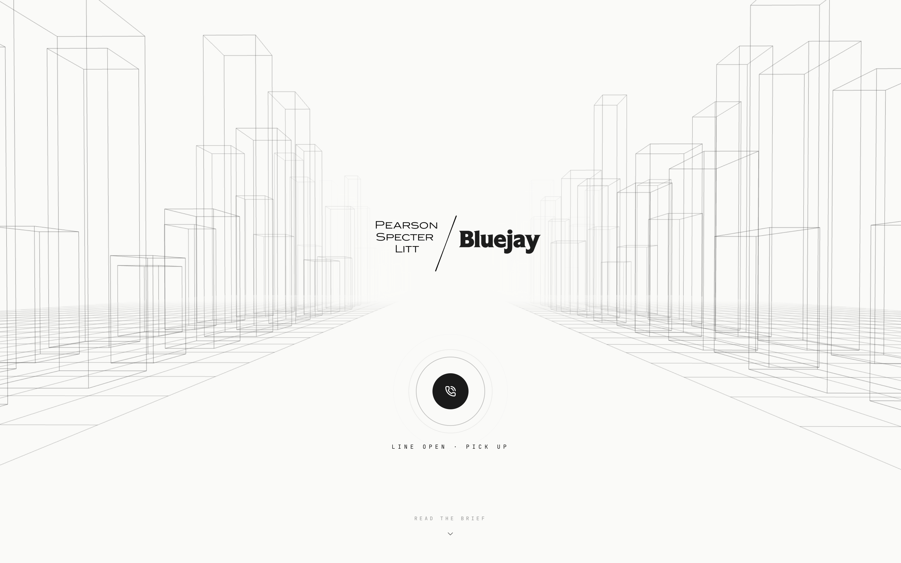

<div align="center">



# harvey helps you with your legal questions.

`LiveKit Cloud` · `OpenAI` · `Deepgram Nova-3` · `ElevenLabs Turbo v2.5` · `Chroma` · `Next.js 16`

</div>

[demo](https://www.loom.com/share/2f671a72a279425d84bf5baa298d1efd) · [site](https://harvey-two.vercel.app/)

---

## Why I built this

I'm a student. My friends and I run into dumb legal situations constantly. Someone gets pulled over doing 50 over and panics about stunt driving. Someone's landlord serves an N12. Someone gets fired the week before payday. Someone shows up to a bar with a fake ID. The answer is always the same: we don't know, and nobody's calling a lawyer at 2am.

So I built the lawyer that picks up.

Harvey is voice-first, covers the law that students actually bump into (traffic, tenancies, employment, criminal code, cannabis, drugs, consumer), and grounds every legal answer in real statute text instead of vibes. On top of that he pulls live news when you ask about something in the headlines, live stock quotes when a company comes up, and Congressional trading disclosures when you want the insider angle, because once you start calling your lawyer you tend to start asking about other things too.

The whole experience is themed as Gabriel Macht's Harvey Specter from Suits. His voice is cloned from the show. The landing page is staged as a Pearson Specter Litt x Bluejay collab. Every tool call drops an on-screen pane so you can see what he's citing while he talks.

---

## What you can ask him

1. **Canadian legal questions.** He cites the actual statute from a 7-document, 2,806-chunk corpus of Ontario and federal law.
2. **News and current events.** He pulls live Google News headlines, spotlights the top article, and narrates a one-sentence synthesis.
3. **Public company questions.** He pulls a live Yahoo Finance quote (price, change, day range, 52-week range) and docks it on screen.
4. **Insider trading disclosures.** Ask about Congressional activity on a ticker and he pulls the latest STOCK Act filings (QuiverQuant when a key is set, bundled dataset otherwise).

Each one fires its own function tool and renders its own pane. The UI stays in sync with whatever Harvey is talking about in real time.

---

## 1. How it works, end to end

```
 Browser (Next.js 16, React)
   │
   │  GET /api/token   (mint LiveKit JWT)
   │  WebRTC audio up + data channel down
   ▼
 LiveKit Cloud  (us-east)
   │
   │  dispatches job to registered worker
   ▼
 Python agent (Fly.io, iad)
   │   Deepgram Nova-3 STT
   │   GPT-4o-mini (LLM + tool calling)
   │   ElevenLabs Turbo v2.5 TTS (cloned Harvey voice)
   │   Silero VAD
   │
   │   6 function tools:
   │     cite_statute     → Chroma (RAG)
   │     current_events   → Google News RSS
   │     stock_ticker     → Yahoo Finance
   │     check_the_hill   → QuiverQuant or bundled dataset
   │     manage_screen    → UI pane control
   │     end_call         → hangs up, triggers receipt
   ▼
```

Flow of a single turn:

1. You hit **Call**. Frontend gets a JWT from `/api/token`, joins the LiveKit room.
2. LiveKit dispatches the agent worker running on Fly.
3. Worker joins and speaks a canned greeting line via `session.say(...)` the moment the audio stream connects, so first audio hits before the LLM is warm.
4. You talk. Deepgram streams the transcript. Silero VAD + LiveKit turn detection signal end-of-turn.
5. The LLM (gpt-4o-mini) decides whether to answer directly or call a tool.
6. A tool fires. It publishes a JSON event over the LiveKit data channel. The frontend listens and spawns a pane via Framer Motion.
7. Harvey speaks. The pinwheel's six wings react to the TTS audio via `useMultibandTrackVolume`.

---

## 2. RAG 

### What's in the corpus

7 English-only statutes scoped to the situations students actually hit. 2,806 chunks, ~610 MB Chroma index.

| Source | Chunks | What it covers |
|---|---|---|
| Ontario Highway Traffic Act | 1,100 | Speeding, stunt driving, suspensions, G1/G2 rules |
| Canada Criminal Code | 785 | Assault, theft, fraud, drugs, sexual offences |
| Ontario Residential Tenancies Act | 392 | Leases, evictions (N12, N13), rent, roommates |
| Ontario Employment Standards Act | 359 | Minimum wage, overtime, tips, termination |
| Canada Controlled Drugs and Substances Act | 69 | Possession schedules beyond cannabis |
| Canada Cannabis Act | 57 | Possession limits, public use, driving impaired |
| Ontario Consumer Protection guides | 44 | Contracts, cooling off periods, returns |

Iteration 1 was bigger but worse. I originally ingested 31 PDFs including bilingual Canadian federal statutes. The French and English were interleaved on the same page, which poisoned the embeddings and caused French chunks to surface even for English queries. Culled everything bilingual, re-ingested with an English-only filter, and backfilled with 5 statutes pulled directly from Justice Laws Canada (federal) and the Wayback CDX API (Ontario e-Laws).

### Pipeline

```
cite_statute(query)
    │
    ▼
 1. classify_query(query)   LLM router (gpt-4o-mini)
                            picks source, returns a
                            refined semantic query
    │
    ▼
 2. Chroma similarity_search
      if classifier confidence ≥ 0.6 → filter to that source
      else → broad search with keyword boost
    │
    ▼
 3. noise filter (drop chunks < 60 chars)
    │
    ▼
 4. publish statute_card on data channel
 5. return top-1 text to LLM so Harvey can verbalize
```

**Two-stage retrieval was the big unlock.** Plain cosine similarity was failing on acronyms (N12 has no semantic link to "notice of termination") and jargon overlaps ("assault" kept pulling Highway Traffic Act because the Criminal Code dominates by chunk volume). Putting a classifier in front of Chroma lifted accuracy from ~40% to 98% across a 45-query test battery.

### RAG stack

| Layer | Choice | Why |
|---|---|---|
| Framework | LangChain (`langchain-community`, `langchain-chroma`) | Mature loader + splitter, minimum glue |
| Loader | `PyPDFLoader` for PDFs, `BeautifulSoup` for HTML | Pure Python, no Poppler |
| Chunking | `RecursiveCharacterTextSplitter`, 1000 chars, 200 overlap | Respects paragraph boundaries. Most statute sections fit in a single chunk. |
| Embedding | `text-embedding-3-small` (OpenAI), 1536 dim | Good latency + cost at quality this corpus needs |
| Vector DB | Chroma, embedded, persisted to `data/chroma_db/` | Zero ops, baked into the Docker image |
| Retrieval | `similarity_search(query, k=10)` + optional source filter | Top-1 chunk goes to the LLM, top-3 go to the card |

Each chunk is tagged with `source`, `page`, `jurisdiction`, and `section` (regex-extracted when present). That metadata is what lets the frontend render a proper legal-brief card with the section header, jurisdiction badge, and source attribution.

---

## 3. Tools

The spec asks for one tool. Shipped six, because one tool is a dead UI.

| Tool | When it fires | What renders |
|---|---|---|
| `cite_statute` | Any legal question | Statute card with section, title, quote, source |
| `current_events` | News, "recent", anything time-sensitive | News ticker + article spotlight |
| `stock_ticker` | Public company mentioned | Stock card with price, change, day range, 52-week range |
| `check_the_hill` | "insider", "Congress", "STOCK Act" keywords | Hill intel pane with recent disclosed trades |
| `manage_screen` | Harvey wants to clear or expand a pane | UI action only, no render |
| `end_call` | User says "bye", "gotta go", "hang up" | Triggers the receipt overlay and call exit |

Each one publishes a JSON event over the LiveKit data channel. The frontend's `useDataChannel` listener decodes the payload and spawns a pane via `AnimatePresence`. Cycling evidence model: a new content pane auto-focuses center stage and evicts the previous one, so the screen stays legible instead of growing a wall of stale cards during a long call.

---

## 4. Voice and personality

**Voice.** ElevenLabs Instant Voice Cloning on a 10-minute sample of Gabriel Macht's dialogue from Suits. Served through the `eleven_turbo_v2_5` model for sub-200ms first audio. `VoiceSettings(stability=0.50, similarity_boost=0.85, style=0.0, speed=0.90, use_speaker_boost=True)`, tuned against ear-tested samples.

**Personality.** The system prompt (`backend/prompts.py`) carries 37 verbatim Harvey Specter lines from the show as cadence anchors. Explicit rules baked in:

- Replies are 1 to 3 sentences, 15 to 45 words.
- Land a quip every two or three turns, not every turn.
- Always contractions. Never "I think" or "I'm not sure".
- Off-topic gets deflected with a zinger.
- At least one tool call per non-social turn, so the UI stays alive.

**First-audio trick.** The canned greeting (`session.say("Goddamn it. You're back.")`) fires the instant the user's audio connects, which hides 600 to 900ms of cold start and sells the character before the LLM even reads the first word.

---

## 5. Design decisions and tradeoffs

### What I did differently

**LLM-routed retrieval, not pure cosine.** Standard vector search was brittle on the query space students actually use. A small gpt-4o-mini call in front of Chroma classifies the domain and rewrites the query before the similarity search runs. Adds ~500ms to the first retrieval. Worth it.

**One-topic panes, not a growing wall.** Each tool call evicts the previous content pane and takes center stage. A statute card gets replaced by the stock card on the next turn. Keeps the UI readable during a long call.

**Instant greeting before the LLM is warm.** See the voice section above. This is the single biggest perceived-latency win in the whole system.

**37 real Harvey lines in the prompt.** Baked show quotes into the system prompt so the LLM drifts toward Harvey's rhythm instead of corporate-assistant register.

### Tradeoffs

| Decision | Tradeoff |
|---|---|
| Chunk size 1000, overlap 200 | Most statute sections fit in one chunk. A few long Criminal Code sections get split. Acceptable, retrieval still surfaces the right section. |
| `text-embedding-3-small` over `-large` | ~3x faster, ~5x cheaper. Quality is fine for this corpus. For high-stakes legal production I'd upgrade. |
| Chroma embedded, not managed | Zero ops, persists to disk, baked into the image. Not horizontally scalable. For a product, Pinecone or pgvector. |
| GPT-4o-mini, not GPT-4o | Sub-second first token, ~30x cheaper. Quality is enough because Harvey's output is short and structured (tool call + 1 to 3 sentences), not a long chain of reasoning. |
| ElevenLabs Turbo v2.5, not multilingual v2 | Sub-200ms first audio, noticeably better prosody on short conversational lines. Slight quality drop on long sentences. Harvey doesn't have long sentences. |
| Instant Voice Cloning, not Professional | Free and instant. Ceiling around 80 to 85% of the real Gabriel Macht. Pro cloning would need a biometric consent process we can't pass. |
| LiveKit transport, not raw WebRTC | Turn detection, VAD, transcript streaming, data channel, audio routing all come for free. Tradeoff is one extra hop. Worth it by a lot. |
| Fly.io for the agent, not AWS | Outbound-only worker means no ALB, no security group, no task definition song and dance. `fly-deploy.sh` is ~40 lines. AWS Fargate config is retained at `deploy/DEPLOY.md` as a fallback path. |
| Bundled Congressional data fallback | QuiverQuant's live endpoint requires a paid key. `data/congress_trades.json` carries 38 real disclosures with real file dates so the tool always has something to show. Wire in a key and it calls Quiver first. |
| Fixed corpus, no PDF upload | Spec marks upload as optional. The whole exercise is "specific fact on a known dataset", so I kept the corpus fixed and spent the time on UI polish and retrieval quality. |

### Assumptions

- **Demo only, not actual legal advice.** Harvey says this out loud when a question gets heavy.
- **Student-scoped law.** Corpus covers Ontario and federal statutes students actually run into. No immigration, income tax, family law, or US federal.
- **English only.** Canadian federal statutes are bilingual; I strip French at ingest time.
- **Single worker, single region.** The Fly machine lives in `iad`. LiveKit Cloud picks the closest relay for the browser.

---

## 6. Stack

| Layer | Choice |
|---|---|
| Voice transport | LiveKit Cloud |
| STT | Deepgram Nova-3 |
| LLM | GPT-4o-mini (also used for the RAG query classifier) |
| TTS | ElevenLabs Turbo v2.5 |
| VAD | Silero |
| RAG framework | LangChain |
| Vector DB | Chroma (embedded) |
| Embedding | `text-embedding-3-small` (OpenAI) |
| Frontend | Next.js 16 (App Router), React, Framer Motion, Tailwind, three.js |
| Agent host | Fly.io (us-east, iad) |
| Frontend host | Vercel |

---

## 7. Local setup

Requires Python 3.11+, Node 20+, and keys for OpenAI, Deepgram, ElevenLabs, plus a LiveKit Cloud project.

### Backend

```bash
cd backend
python3 -m venv .venv
source .venv/bin/activate
pip install -r requirements.txt

cp .env.example .env                 # fill in keys
python ingest_student_laws.py        # builds data/chroma_db (~3 min)
python agent.py dev                  # registers the worker
```

### Frontend

```bash
cd frontend
cp .env.local.example .env.local     # LiveKit URL + keys
npm install
npm run dev                          # http://localhost:3000
```

Hit **Take the call**. Boot sequence plays, PSL x Bluejay lands center, the sonar button fades in. Click it.

---

## 8. Deploy

Frontend on Vercel, agent on Fly.io.

- **Frontend → Vercel.** `frontend/` directory, three env vars (`LIVEKIT_API_KEY`, `LIVEKIT_API_SECRET`, `NEXT_PUBLIC_LIVEKIT_URL`). ~2 minutes.
- **Agent → Fly.io.** `./deploy/fly-deploy.sh`. Builds the Docker image with the Chroma index baked in, pushes to Fly's registry, rolls the machine. Single region (iad), 1 vCPU, 1GB. Outbound only, no inbound HTTP surface needed.
- **AWS path available.** Retained at `deploy/DEPLOY.md` (ECR + ECS Fargate + IAM) if you want to run Harvey on Amazon instead.

Files that keep deploy reproducible:

- `backend/Dockerfile` with Python 3.12 slim, CPU-only torch for Silero VAD, Chroma index baked in.
- `.dockerignore` excludes the 105MB raw corpus PDFs (already embedded in Chroma) and the frontend.
- `deploy/fly-deploy.sh` is the primary path. `deploy/task-definition.json` and `deploy/trust-policy.json` are the AWS fallback.

---

## 9. Repo layout

```
harvey/
├─ backend/
│  ├─ agent.py                 LiveKit worker entry + session wiring
│  ├─ tools.py                 6 function tools
│  ├─ prompts.py               system prompt + 37 Harvey lines
│  ├─ rag.py                   Chroma wrapper + LLM query classifier
│  ├─ ingest_student_laws.py   current ingest (Justice Laws + e-Laws)
│  ├─ reingest_canada.py       English-only cleanup script
│  ├─ requirements.txt
│  └─ Dockerfile
├─ frontend/
│  ├─ app/                     Next.js 16 App Router
│  │  └─ api/token/            LiveKit JWT minter
│  └─ components/              CallInterface, CaseDocs, panes, Pinwheel
├─ data/
│  ├─ corpus/                  source PDFs
│  ├─ chroma_db/               vector index (gitignored, rebuild via ingest)
│  └─ congress_trades.json     bundled Hill dataset
├─ deploy/
│  ├─ fly-deploy.sh            primary deploy path
│  ├─ DEPLOY.md                AWS Fargate zoom script (fallback)
│  └─ task-definition.json     Fargate task def (fallback)
└─ docs/
   ├─ hero.png
   └─ demo.mp4                 5-minute walkthrough
```

---

## 10. Submission checklist

- [x] LiveKit Cloud voice transport
- [x] Python agent with STT, LLM, TTS, VAD pipeline
- [x] RAG over 7 statute sources (2,806 chunks) with source + page metadata
- [x] Deployed to Vercel (frontend) and Fly.io (agent)
- [x] React frontend with Start Call, End Call, and live transcript
- [x] At least one tool call that fits the narrative (shipped 6)
- [x] Personality and story (Harvey Specter, PSL x Bluejay)
- [x] Short design doc (this file)
- [x] 5-minute demo video

---

<div align="center">
<sub>© 2026. Pearson Specter Litt x Bluejay. Confidential. Privileged.</sub>
</div>
